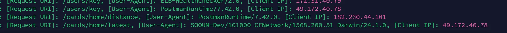

### AOP

- 관점 지향 프로그래밍
    - 공통된 부분을 좀 더 쉽게 프로그래밍하는 기법
- 컨트롤러의 대한 기록을 남기고싶었음
    - 요청 URI, User-Agent, Client IP를 남기려 할때
- 만약 AOP를 사용하지 않으면 각 controller에 전부 이 코드를 써줘야 한다!
    - 이러한 반복되는 작업을 분리하여 전처리 혹은 후처리가 가능하도록 AOP를 적용할 수 있음!
- 먼저, 적용되기 전 코드

```java
@RestController
@Slf4j
@RequestMapping("/api")
public class SampleController {

    @GetMapping("/example")
    public ResponseEntity<String> exampleEndpoint (HttpServletRequest request) {
        
        // 요청 정보를 추출
        String ip = request.getHeader("X-Forwarded-For");
        if (ip == null || ip.isEmpty() || "unknown".equalsIgnoreCase(ip)) {
            ip = request.getRemoteAddr();
        }

        String userAgent = request.getHeader("User-Agent");
        String requestUri = request.getRequestURI();

        // 로그 기록
        log.info("[Request URI]: {}, [User-Agent]: {}, [Client IP]: {}",
                requestUri, userAgent, ip);

        // 실제 비즈니스 로직
        return ResponseEntity.ok("Success");
    }
}
```

- AOP 적용 후

```java
//AOP 의존성 추가
implementation 'org.springframework.boot:spring-boot-starter-aop'
```

- 적용할 어노테이션
- `@Aspect`
    - 여러 클래스에 걸쳐 있는 관심사의 모듈화
- `@Before`
    - 대상 “메서드”가 실행되기 전에 Advice를 실행
- `@Pointcut`
    - Advice를 적용할 메소드의 범위를 지정하는 것을 의미

<Pointcuts>

```java
@Component
public class Pointcuts {
    @Pointcut("@within(org.springframework.web.bind.annotation.RestController)")
    public void requesterPointcut() {}
}
```

- `@RestController` 이 선언된 모든 클래스의 메서드에 대해 AOP 적용
- 참조를 위해 빈 메서드

<RequestInfoAspect>

```java
@Slf4j
@Profile("prod")
@Aspect
@Component
@RequiredArgsConstructor
public class RequesterInfoAspect {

    @Before("com.sooum.global.aop.pointcut.Pointcuts.requesterPointcut()")
    public void before() {
        HttpServletRequest request = ((ServletRequestAttributes) RequestContextHolder.getRequestAttributes()).getRequest();

        String ip = request.getHeader("X-Forwarded-For");
        if (ip == null || ip.isEmpty() || "unknown".equalsIgnoreCase(ip)) {
            ip = request.getRemoteAddr();
        }

        log.info("[Request URI]: {}, [User-Agent]: {}, [Client IP]: {}",
                request.getRequestURI(),
                request.getHeader("User-Agent"),
                ip);
    }
}

```

- 해당 클래스가 AOP 핵심 로직을 담고 있음
- 프로덕션 환경에서만 동작하도록 설정
- 지정된 포인트컷(`requesterPointcut`)에 매칭되는 메서드가 실행되기 **전**에 동작
    - `@RestController` 클래스의 메서드 실행 전에 로직이 수행
    - `HealthCheckControlle`r에는 적용안되도록
- 로그 확인
    - `Request URI`: 요청된 API 경로
    - `User-Agent`: 클라이언트의 브라우저/앱 정보
    - `Client IP`: 요청을 보낸 클라이언트의 IP 주소

<결과>

