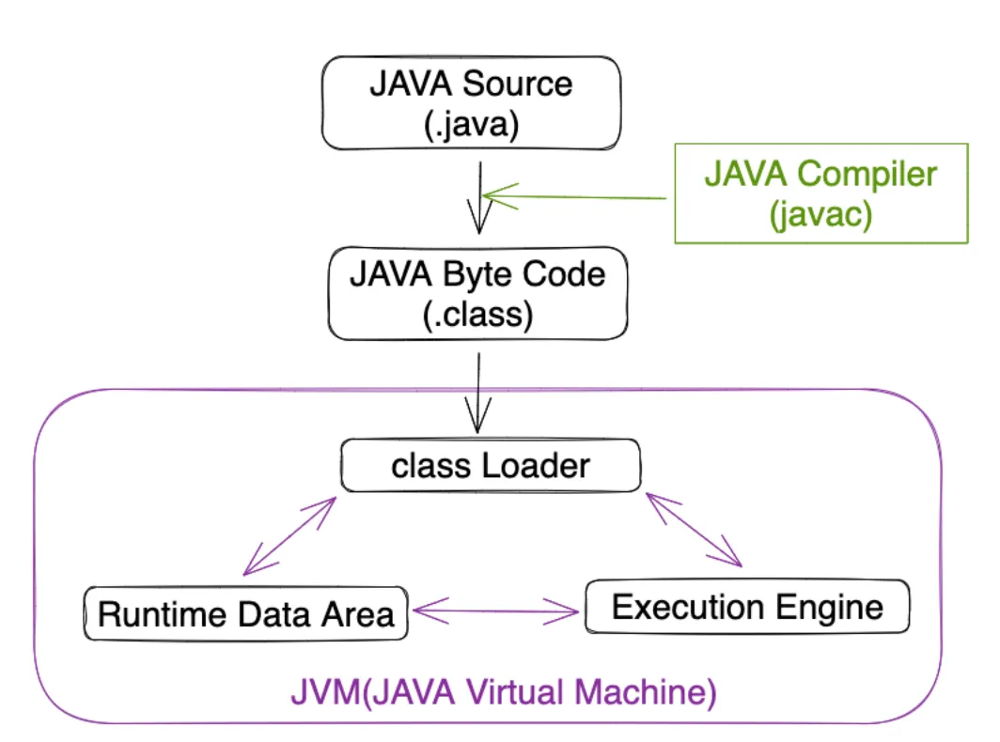
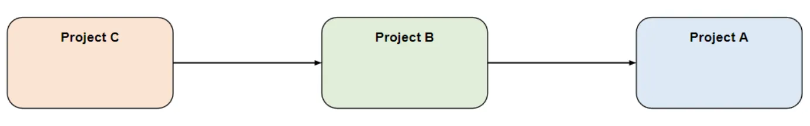
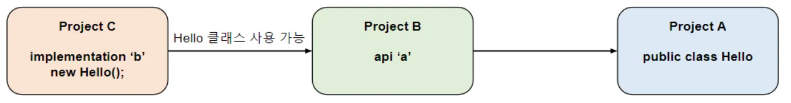
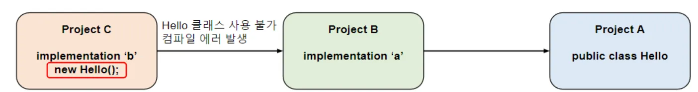

### 클래스 패스(class path)

- 클래스 패스란?
    - 자바로 작성된 프로그램은 자바 컴파일러가 java 파일들을 컴파일하여 바이트 코드로 만든다.
    - JVM(Java Virtual Machine)의 클래스 로더가 읽어들인다.
    - 애플리케이션 실행 시 바이트 코드 → 기계어로 번역한다.
    - 자바 런타임 환경에서 자바 애플리케이션을 컴파일(complie)하고 실행(run)할때
        - 자바 컴파일러와 JVM이 특정 경로에서부터 클래스 파일과 패키지를 탐색 → 클래스 패스(class path)
- complie class path
    - 자바 컴파일 탐색하는 경로
- runtime class path
    - 실행 시 탐색하는 경로

- complie class path
    - java 코드를 class 파일로 컴파일할 때 탐색하는 경로
    - 에러 없이 컴파일을 하기 위해 필요한 클래스와 jar들의 경로
    - 런타임에서 필요한 다른 클래스와 jar가 필요할 수 있기 때문
- runtime class path
    - 애플리케이션이 정상적으로 실행하기 위해 필요한 클래스들과 jar들의 경로
    - 컴파일된 자바 코드(class 파일)을 JVM이 실행할 때 탐색하는 경로이다.

### 의존성 옵션

- compileOnly: 컴파일 경로에만 설정
- runtimeOnly: 런타임 경로에만 설정
- implementation: 두 경로에 모두 설정
- api: 두 경로에 모두 설정

### implementation , api 차이

- 전이 의존성 또는 추이 의존성이란?

  

    - ProjectC → ProjectB → ProjectA
    - Project C는 B에 의존하고, B는 A에 의존할 경우
        - Project C도 A에 의존하게 되는 것을 전이 의존성 또는 추이 의존성

<예시>

- api : 전이 의존성 허용

  

    - Project C가 implementation을 통해 B에 의존하고, B가 api를 사용하여 A에 의존할 경우
    - **Project C는** implementation을 통해 Project B의 컴파일 경로, 런타임 경로 등이 노출됨과 동시에 Project B의 api의 전이 의존성을 통해 **Project A도 사용 가능**
- implementation 전이 의존성 허용x

  

    - Project B에서 implementation을 사용하여 A에 의존하고 있으므로, Project C에서 **A의 코드에 접근이 불가능**
    - 만약 A의 코드에 접근을 시도할 경우 **컴파일 에러**

### implementation

1. **은닉성**
    1. **유지**프로젝트의 내부 구현을 다른 모듈과 분리하여 은닉할 수 있어 외부에 불필요한 의존성을 노출시키지 않고 모듈을 보다 깔끔하게 유지할 수 있도록 도와준다.
2. **컴파일 타임 최적화**
    1. implementation으로 선언된 의존성은 컴파일 타임에만 필요하므로, 프로젝트 빌드 속도를 높일 수 있다. 이는 불필요한 의존성이 런타임에 모듈에 포함되지 않아야 할 때 유용하다.

### **api**

1. **외부 모듈에 공개**
    1. 다른 모듈이 해당 의존성을 사용할 수 있으므로, API로 제공되는 기능을 외부에 공개하고 활용할 수 있다.
2. **동적한 모듈 간 의존성 관리**
    1. api로 선언된 의존성은 다른 모듈이 직접적으로 사용할 수 있으므로, 모듈 간의 의존성 관리가 더욱 동적으로 이루어질 수 있다.

### 그럼 멀티모듈에서는?

- api를 사용할 경우
    - 실수로 전이 종속성에 빠질 수 있기 때문에 **가능한 implementation을 사용**하는 것이 좋다.
- implementation을 사용할 경우
    - 모듈을 사용하는 곳의 컴파일 클래스 경로에서 종속성을 유지할 수 있다.
    - implementation으로 선언된 라이브러리가 사용되려고 할 때 컴파일 에러가 발생한다.
        - 프로젝트의 구조와 의존성을 명확하게 관리하고 의도치 않은 의존성이 노출되는 것을 방지할 수 있다.